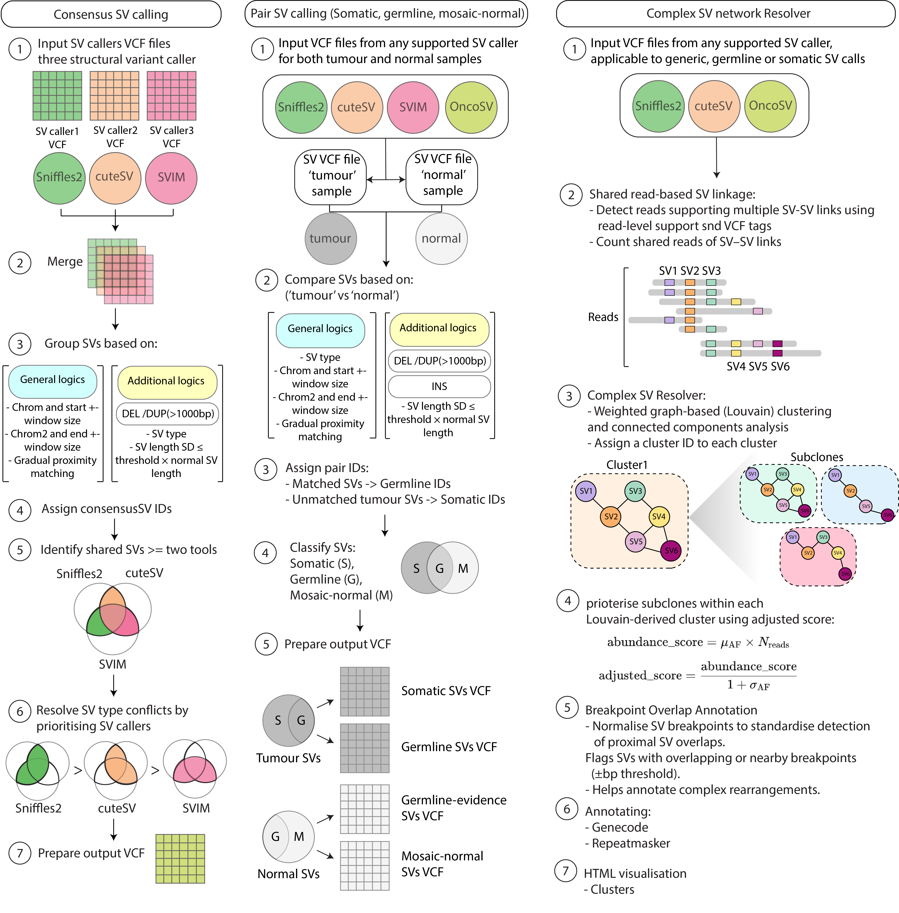

OncoSV
=======

OncoSV is a modular Python toolkit for structural variant (SV) analysis using long-read sequencing data. It supports consensus calling from multiple SV callers, tumour-normal SV analysis, complex event detection, and subclone reconstruction using graph-based methods.

Key Features
------------

- Consensus SV calling from Sniffles2, CuteSV, SVIM
- Somatic vs germline classification from tumour-normal pairs
- Complex SV event identification using shared reads and proximity
- Subclone detection based on SV network clustering
- Fully annotated VCF output (INFO and FORMAT fields)
- Interactive HTML visualizations of SV graphs
- Chromosome-wise processing and filtering

<p align="left">
  
</p>

Installation
------------

We recommend installing OncoSV in a dedicated Python environment.

### 1. Set up a virtual environment (optional but recommended)

Using `venv`:
```bash
python3 -m venv oncosv_env
source oncosv_env/bin/activate
```

Using `conda`:
```bash
conda create -n oncosv_env python=3.10 -y
conda activate oncosv_env
```

### 2. Install OncoSV

#### Option A: From GitHub (recommended for most users)
```bash
pip install git+https://github.com/mjtnaeini/OncoSV.git
```

#### Option B: Clone the repository and install manually
```bash
git clone https://github.com/mjtnaeini/OncoSV.git
cd OncoSV
pip install .
```

#### Option C: Development mode (for contributors)
```bash
pip install -e .
```

Requirements
------------

### Essential dependencies (installed automatically):
- pandas
- numpy
- networkx
- matplotlib
- pysam
- python-louvain
- pyvis

Command-Line Interface
----------------------

All commands use the unified CLI:

```
oncsv --help
```

### 1. Consensus Calling (Single Sample Only)
Merge SVs from multiple callers:
```
oncsv consensus \
  -s sample.sniffles.vcf.gz \
  -c sample.cutesv.vcf.gz \
  -v sample.svim.vcf.gz \
  -o output/sample_consensus.vcf.gz \
  --quality-threshold 10 \
  --chrom chr1,chr2
```

**Required arguments:**
- `-s`, `-c`, `-v`: Input VCFs from Sniffles, CuteSV, and/or SVIM
- At least 2 SV callers are required.

**Optional arguments:**
- `--quality-threshold`: Minimum quality threshold (default: 10)
- `--chrom`: Specify chromosomes to include (comma-separated)

### 2. Tumour-Normal Comparison
Classify variants as somatic or germline:
```
oncsv pair \
  -t tumour.vcf.gz \
  -n normal.vcf.gz \
  --normal-mode single \
  --svcaller consensus \
  --only-somatic \
  -o output/
```

**Required arguments:**
- `-t`: Tumour VCF file
- `-n`: Normal VCF file

**Optional arguments:**
- `--normal-mode`: Set to `single` or `multiple` to define if the normal VCF includes pooled samples (default: single)
- `--svcaller`: Which SV caller was used (sniffles, cutesv, svim, or consensus)
- `--only-somatic`: If set, only variants unique to the tumour will be output
- `--exclude-somatic`: Outputs only germline variants
- `--tumour-sample-id` / `--normal-sample-id`: If using multi-sample VCFs

### 3. Complex SV + Subclone Detection
Use read-sharing and proximity to define SV networks and detect subclones:
```
oncsv complexSV \
  --vcf output/sample_consensus.vcf.gz \
  --output_dir output_dir \
  --sample_id Sample01 \
  --chrom all
```

**Required arguments:**
- `--vcf`: Input VCF (can be consensus, somatic, or single-caller)
- `--output_dir`: Where results are written

**Optional arguments:**
- `--chrom`: Chromosomes to include (`all` or comma-separated list)
- `--sample_id`: Sample name for file labeling
- `--min-shared`: Minimum number of shared reads to link SVs (default: 2)
- `--proximity`: Maximum breakpoint proximity to consider SVs connected (default: 1000 bp)

Output Files
------------

| File                                 | Description                              |
|--------------------------------------|------------------------------------------|
| *_consensus.vcf.gz                   | Merged SVs from multiple callers         |
| *_somatic_variants.vcf.gz           | Tumour-only SVs                          |
| *_germline_variants.vcf.gz          | Shared variants in tumour and normal     |
| *_mosaic_normal.vcf.gz              | Variants only in the normal sample       |
| *_complexSV_groups_networks.csv     | Network-based complex SV clusters        |
| *_clone_stats.csv                   | Count of SVs per subclone                |
| *_interactive.html                  | Interactive graph of SV networks         |

Annotations
-----------

### INFO fields:
- `SVTYPE`, `SVLEN`, `END`, `AF`, `RNAMES`
- `NUM_CALLERS`, `ConsensusSV_ID`, `Variant_ID`, `Subclone`

### FORMAT fields:
- `GT`, `GQ`, `DV`, `DR`

Subclone Analysis
-----------------

Subclonal grouping is performed using Louvain community detection on SV networks. Nodes (SVs) are connected based on shared reads and breakpoint proximity.

Outputs:
- *_clone_stats.csv: Summary of SV count/type per clone
- *_clone_membership.csv: SVs and their subclone labels
- *_interactive.html: Graph-based clone visualisation

Repository Structure
--------------------

```
OncoSV/
├── cli.py
├── main_consensus.py
├── main_somatic.py
├── main_complexSV.py
├── shared_reads_sv.py
├── find_network_sv.py
├── identify_variants_withID_proximity.py
├── prepare_vcf_output_file.py
├── process_vcf_to_dataframe.py
├── network analysis.py
├── setup.py
└── README.md
```

License
-------

MIT License
